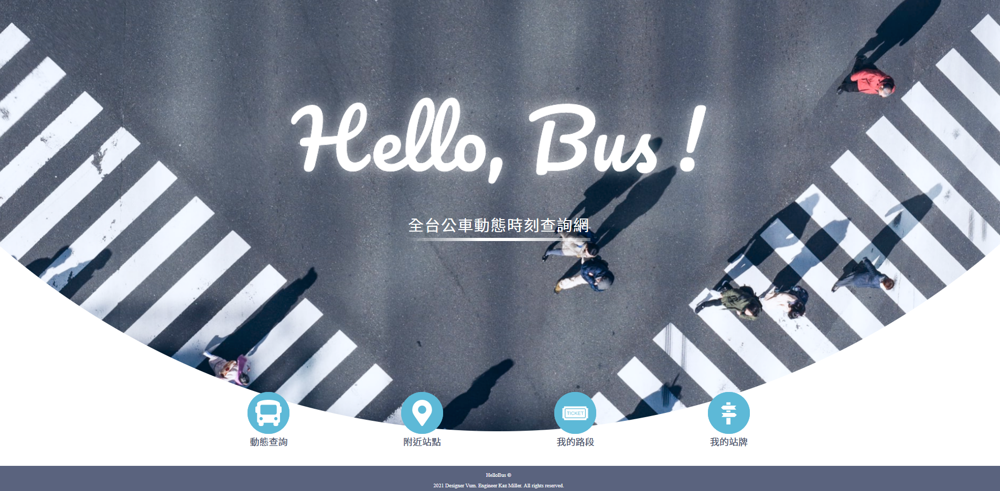
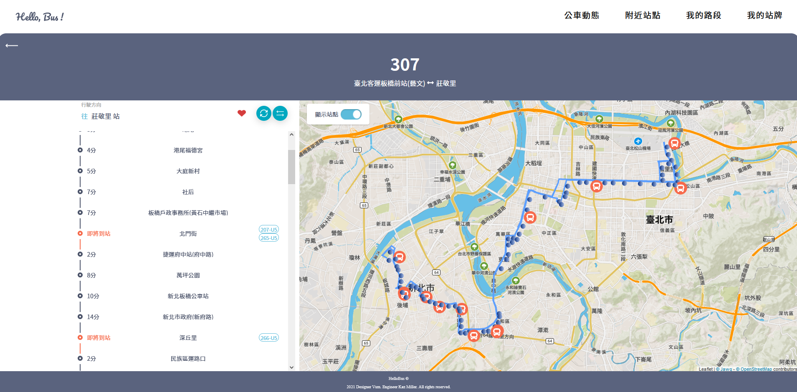
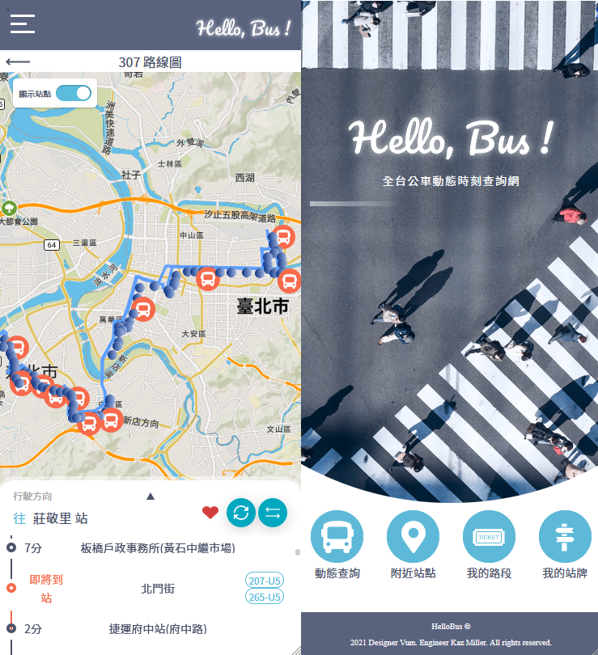

# THE F2E 3rd Week-3 作品：全台公車動態時刻查詢

 ### `Introduction：`
 Welcome to Taiwan , traveler !\
 If youu want to visit around the beautiful country , buses are popular and convenient transportation here . \
 \
 👇 "Hello,Bus!" is a tool : 👇 
 \
 **_which provides the bus coming time , helps user to find their near stops , and allows to build your own favorite bus list !_**
 \
 \
 Hope this tool will make your life more convenient , enjoy it :)

 ### `URL：`
  - [Hello,Bus!](https://hellobus.netlify.app/#/)
 
 ### `功能：`
 
  - 以公車號碼搜尋公車各站名稱、預估抵達時間、路線圖
  - 開啟定位搜尋附近站點
  - 加入公車號碼至收藏清單，方便快速取得公車詳細資訊
  - 加入公車站牌至收藏清單，可即時顯示預估到站時間
 
 ## Demo
 ### `PC：`
 
 
 ### `Mobile：`
 
 
 ### `作者：`
  - UI設計師：[Vum](https://www.figma.com/file/I9HRHRRM2xtTFhoGuJjcJn/The-F2E_week3)
  - 前端工程師：Kaz Miller
  - THE F2E 3rd : [Link](https://2021.thef2e.com/)
 
 ##  User story :

    1.我可以透過網站上的搜尋介面，搜尋指定公車路線的站序資料。
    2.我可以透過網站上的公車路線資訊，獲得我所在站牌的下一班公車預估到站時間。
    3.我能透過 PC 網站瀏覽，也能透過 Mobile 來瀏覽介面
    
 
 ## 專案說明 :
 
 ### `系統說明：`
  - Node.js version : v14.17.1
 
 1.專案安裝 
 ```
 npm install
 ```
 
 2.執行dev開發者模式 
 ```
 npm run start
 ```
 
  3.匯出專案 
 ```
 npm run build
 ```
 
 
 
 ### `資料夾說明：`

``` 
 /public : html 根目錄。
 /src ------ /API : Axios default 設定 
        |
        | -- /components : 會廣泛使用的React組件。(Ex: bottom , header , input ... )
        |
        | -- /helper : 程式中會反覆使用的 variable , function。
        |&emsp;&emsp;     | -- /history : React-route-dom 的自訂 Hash history。
        |     
        | -- /hook : React custom hooks 。
        |
        | -- /img : icons , images 。
        |
        | -- /sass : 全域SASS。( Ex: variable , keyframes , base , reset ...)
        |
        | -- /store : React-Redux 的 Action , Reducer。(p.s:整合在同一個檔案index.js內)
        |
        | -- /views : view 下的每一個資料夾代表一個 page，每個page有其專屬的 component 及 sass 。
        |       | -- /home(首頁)
        |       | -- /searchPage(公車搜尋頁)
        |       ...etc\
        |  
        - App.js : 應用程式開頭。
        - index.js : 主程式進入點。
 ```       
        
        
 ### `使用技術：`
 
 - React ^17.0.2
 - React-route-dom ^5.3.0
 - Redux ^4.1.1
 - Redux-from ^8.3.7
 - Axios ^0.23.0 
 - Sass ^1.43.3
 - wicket ^1.3.8
 - Leaflet
 - RWD
 - CSS grid , flex 
 - Webpack,Babel
 
 ### `第三方服務：`
 
 -PTX 公共運輸整合平台 [Link](https://ptx.transportdata.tw/PTX/)
 
 ### `備註：`
 
 如果遇到公車號碼查詢時輸入後沒反應、或是點擊公車詳細資訊時無畫面出現，麻煩請重新整理頁面即可。\
 (暫時想不出成因，推測可能有API請求發送的限制導致403錯誤，讓頁面無資料顯示。)

## 後記：

資訊的世界需要持續學習與實作，才會發現更多條等待去點亮的技能樹。\
\
這次在公車APP上印象最深刻的學習點是以手機為RWD主導的版面細節，\
為了帶給不同裝置使用者好的體驗，\
在IOS 100vh "feature"、以及讓Mobole 與 PC 顯示不同 component 的課題下了一番功夫。\
框架強大的覆用性也在有限時間的完全體現出來，很多組件都是直接引用前幾周寫好的內容。\
此外也深深感受到後端的重要性，如果有些資料能預先放在自己的後端伺服器，這次在資料的串接上會更加順利。\
\
今後在前端的道路上也會持續前行，首要目標是針對後端做基本的學習、網路資安的認知，\
再來是學習Vue，這次活動藉由閱讀其他工程師的作品發現到Vue有一些開發上的特性是其他框架沒有的，很值得深入了解！\
最後相當感謝六角學院這次舉辦的活動，從自學到現在已過了5個月，在此做一個紀錄點，\
一直以來想做點實用的小工具，但礙於自己設計的美感和經驗不足，許多作品僅停留在功能上的實作。\
然而這次有非常多讓人眼睛為之一亮的精美設計稿，設計師們真的相當厲害，讓我對UI上有了基本的認識！\
可惜一次只能採用一個作品實踐啊...


### `尚未實作功能:`
 - 客運資料
 - 公車時刻表資料
 

